# Name

Brian Newsom

# How many points have you earned?

0/100

(Make your own calculation and replace the number 0 with the points you think you've earned.)

# How many hours have you spent on this?

fill-in-your-answer

# When did you first start working on this week's learning challenges?

Friday afternoon

# What is the most difficult part about this week's challenge?

fill-in-your-answer

# Graph Database I

## Checkpoints (5 points x 3 = 15 points)

### 1. (5 point)

### 2. (5 point)

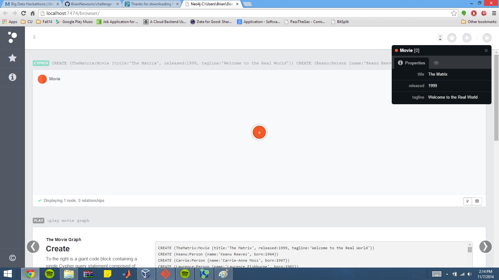

### 3. (5 point)

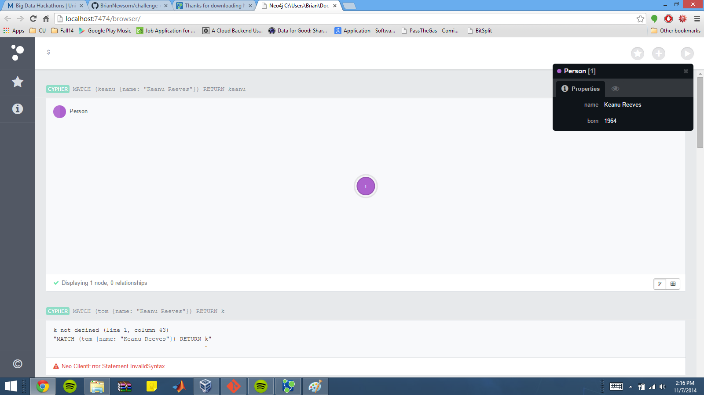

# MongoDB IV

## Challenges (5 points x 4 = 20 points)

### 1. (5 point)

Count

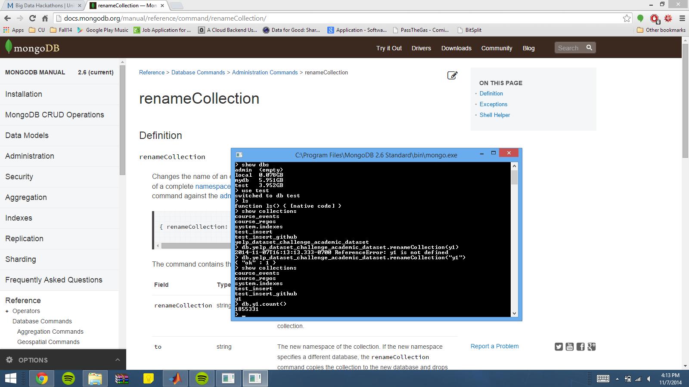

FindOne

Query

### 2. (5 point)

Count

FindOne

Query

### 3. (5 point)

Count

FindOne

Query

### 4. (5 point)

Count

FindOne

Query 1

Query 2

# Machine Learning III

## Checkpoints (5 points x 2 = 10 points)

### 1. (5 point)

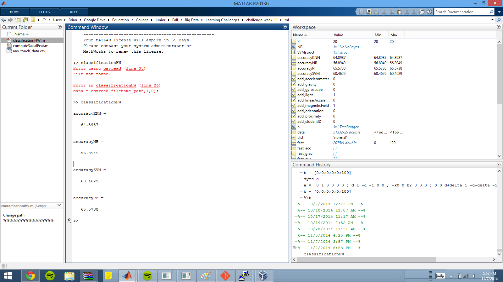

### 2. (5 point)

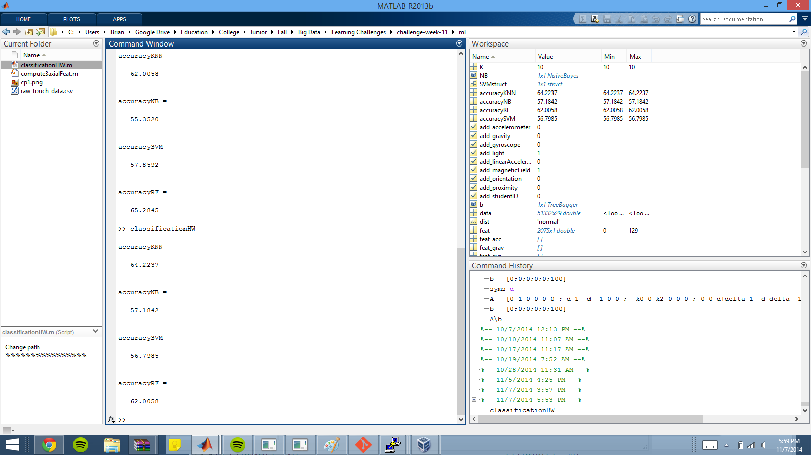

## Challenges (5 points x 4 = 20 points)

### 1. (5 point)

Accuracy = 83.1244

Features/Parameters

	%%%%%%%%% Choose feature source %%%%%%%%%%%
add_accelerometer = true; % Adds accelerometer features
add_gyroscope = true; % Adds gyroscope features
add_magneticField = true; % Adds magnetic field features
add_gravity = true; % Adds gravity features
add_linearAcceleration = true; % Adds linear acceleration features
add_orientation = true; % Adds azimuth, pich and roll features
add_light = true; % Adds light value
add_proximity = true; % Adds proximity value
add_studentID = false; % Adds student ID
%%%%%%%%%%%%%%%%%%%%%%%%%%%%%%%%%%%%%%%%%%%%
 
%%%%%%%%% Choose machine learning classifier parameters %%%%%%%%%%%%%%%
numTrees = 1; % Try different number of trees for the Random Forest classifier
sigma = 1; % Try different values of sigma for the Support Vector Machine classifier
dist = 'normal'; % Try different distributions = {'normal', 'kernel', 'mvmn' , 'mn'} for Naive Bayes classifier
K = 2; % Try different values of K for the K-nearest Neighbor classifier
%%%%%%%%%%%%%%%%%%%%%%%%%%%%%%%%%%%%%%%%%%%%%%%%%%%%%%%%%%%%%%%%%%%%%%%%
 

### 2. (5 point)

Accuracy = 71.0704

Features/Parameters

%%%%%%%%% Choose feature source %%%%%%%%%%%
add_accelerometer = true; % Adds accelerometer features
add_gyroscope = true; % Adds gyroscope features
add_magneticField = true; % Adds magnetic field features
add_gravity = true; % Adds gravity features
add_linearAcceleration = true; % Adds linear acceleration features
add_orientation = true; % Adds azimuth, pich and roll features
add_light = true; % Adds light value
add_proximity = true; % Adds proximity value
add_studentID = true; % Adds student ID
%%%%%%%%%%%%%%%%%%%%%%%%%%%%%%%%%%%%%%%%%%%%
 
%%%%%%%%% Choose machine learning classifier parameters %%%%%%%%%%%%%%%
numTrees = 1; % Try different number of trees for the Random Forest classifier
sigma = 1; % Try different values of sigma for the Support Vector Machine classifier
dist = 'kernel'; % Try different distributions = {'normal', 'kernel', 'mvmn' , 'mn'} for Naive Bayes classifier
K = 1; % Try different values of K for the K-nearest Neighbor classifier
%%%%%%%%%%%%%%%%%%%%%%%%%%%%%%%%%%%%%%%%%%%%%%%%%%%%%%%%%%%%%%%%%%%%%%%%

This seemed to break when I gave it anything but normal or kernel. I'm not sure why..

### 3. (5 point)

Accuracy = 87.4638

Features/Parameters

%%%%%%%%% Choose feature source %%%%%%%%%%%
add_accelerometer = true; % Adds accelerometer features
add_gyroscope = true; % Adds gyroscope features
add_magneticField = true; % Adds magnetic field features
add_gravity = true; % Adds gravity features
add_linearAcceleration = true; % Adds linear acceleration features
add_orientation = true; % Adds azimuth, pich and roll features
add_light = true; % Adds light value
add_proximity = true; % Adds proximity value
add_studentID = true; % Adds student ID
%%%%%%%%%%%%%%%%%%%%%%%%%%%%%%%%%%%%%%%%%%%%
 
%%%%%%%%% Choose machine learning classifier parameters %%%%%%%%%%%%%%%
numTrees = 5; % Try different number of trees for the Random Forest classifier
sigma = 10; % Try different values of sigma for the Support Vector Machine classifier
dist = 'normal'; % Try different distributions = {'normal', 'kernel', 'mvmn' , 'mn'} for Naive Bayes classifier
K = 2; % Try different values of K for the K-nearest Neighbor classifier
%%%%%%%%%%%%%%%%%%%%%%%%%%%%%%%%%%%%%%%%%%%%%%%%%%%%%%%%%%%%%%%%%%%%%%%%

### 4. (5 point)

Accuracy = 86.8852

Features/Parameters

	%%%%%%%%% Choose feature source %%%%%%%%%%%
add_accelerometer = true; % Adds accelerometer features
add_gyroscope = true; % Adds gyroscope features
add_magneticField = true; % Adds magnetic field features
add_gravity = true; % Adds gravity features
add_linearAcceleration = true; % Adds linear acceleration features
add_orientation = true; % Adds azimuth, pich and roll features
add_light = true; % Adds light value
add_proximity = true; % Adds proximity value
add_studentID = true; % Adds student ID
%%%%%%%%%%%%%%%%%%%%%%%%%%%%%%%%%%%%%%%%%%%%
 
%%%%%%%%% Choose machine learning classifier parameters %%%%%%%%%%%%%%%
numTrees = 5; % Try different number of trees for the Random Forest classifier
sigma = 1; % Try different values of sigma for the Support Vector Machine classifier
dist = 'normal'; % Try different distributions = {'normal', 'kernel', 'mvmn' , 'mn'} for Naive Bayes classifier
K = 2; % Try different values of K for the K-nearest Neighbor classifier
%%%%%%%%%%%%%%%%%%%%%%%%%%%%%%%%%%%%%%%%%%%%%%%%%%%%%%%%%%%%%%%%%%%%%%%%

# D3 (VI) (5 points x 7 = 35 points)

### 1. (5 point)

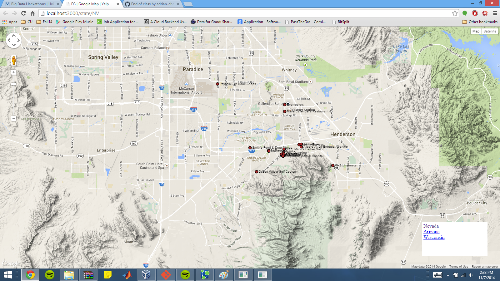

### 2. (5 point)

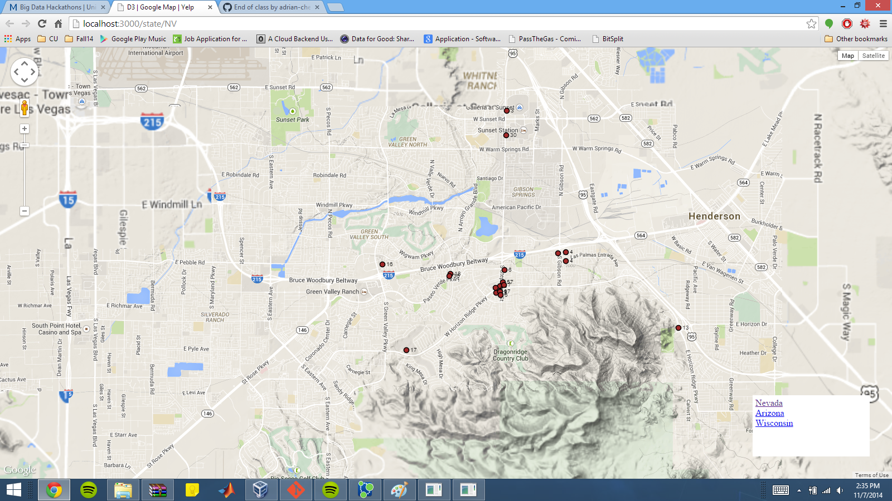

### 3. (5 point)

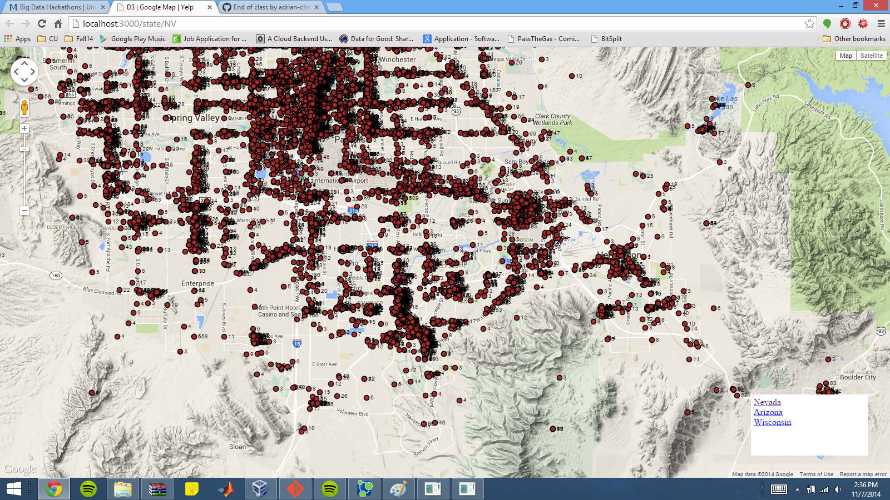

### 4. (5 point)

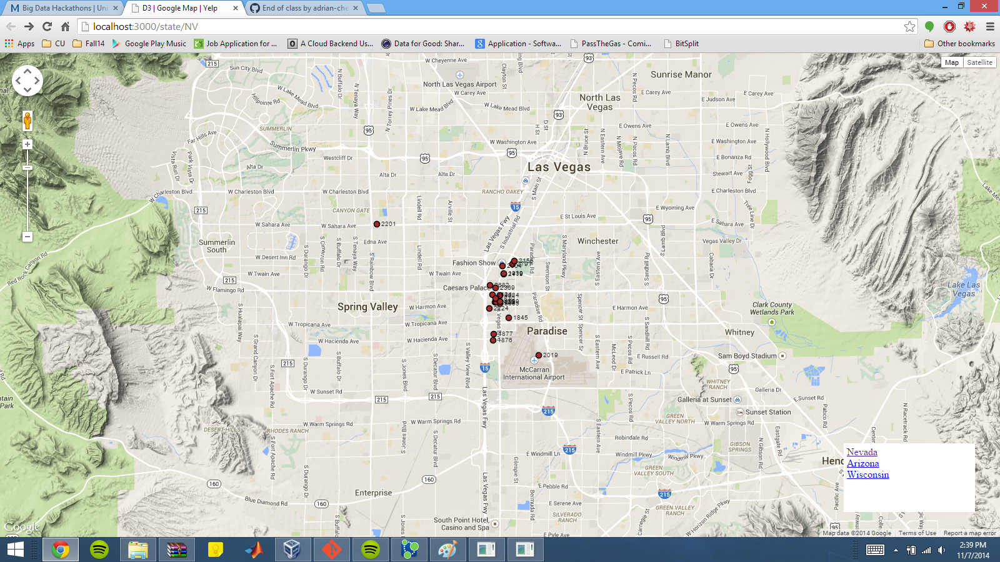

### 5. (5 point)

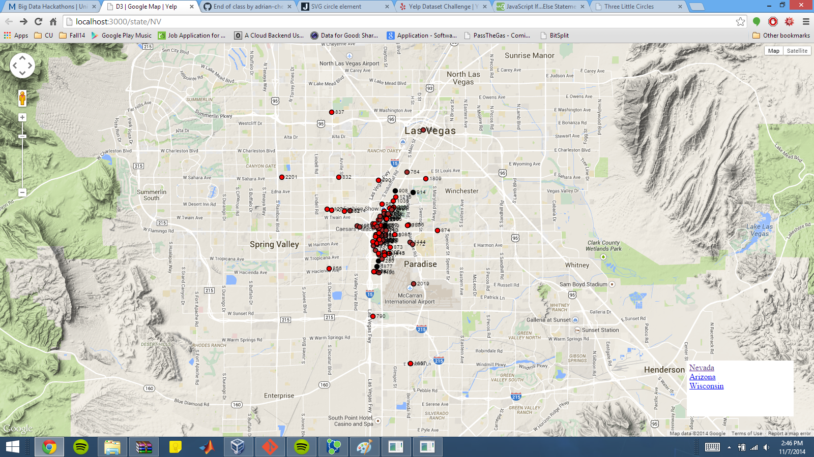

### 6. (5 point)

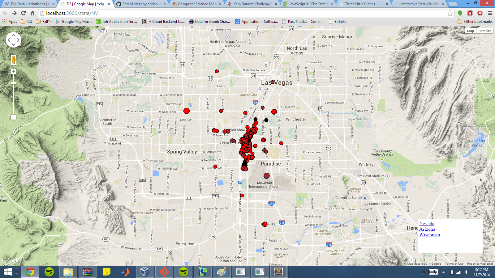

### 7. (5 point)

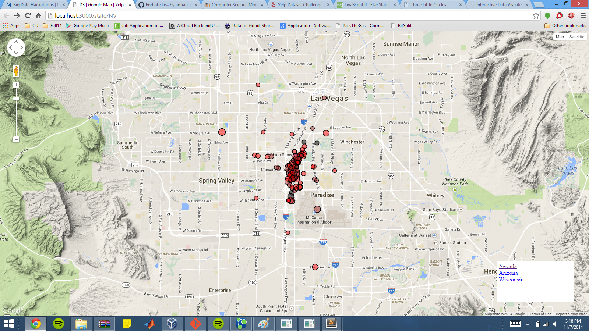
