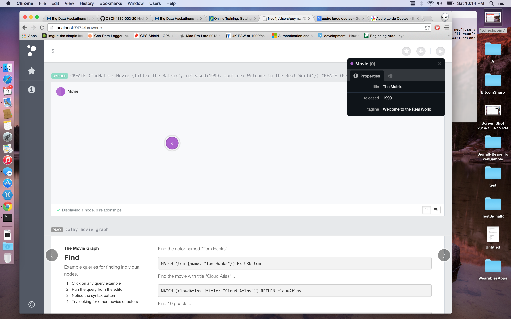
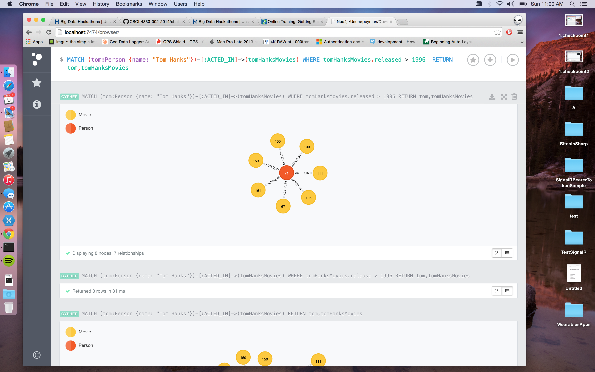

# Name

Peyman Mortazavi

# How many points have you earned?

100/100

(Make your own calculation and replace the number 0 with the points you think you've earned.)

# How many hours have you spent on this?

8 hours

# When did you first start working on this week's learning challenges?

Saturday

# What is the most difficult part about this week's challenge?

Hard to say, MongoDB part had quite some labor work, not hard but long.

# Graph Database I

## Checkpoints (5 points x 3 = 15 points)

### 1. (5 point)

### 2. (5 point)

### 3. (5 point)

# MongoDB IV

## Challenges (5 points x 4 = 20 points)

### 1. (5 point)

Count

FindOne

Query

### 2. (5 point)

Count

FindOne

Query

### 3. (5 point)

Count

FindOne

Query

### 4. (5 point)

Count

FindOne

Query 1

Query 2

# Machine Learning III

## Checkpoints (5 points x 2 = 10 points)

### 1. (5 point)

### 2. (5 point)

## Challenges (5 points x 4 = 20 points)

### 1. (5 point)

Accuracy = {82.4494}

Features/Parameters %%%%%%%%% Choose feature source %%%%%%%%%%% add_accelerometer = false; % Adds accelerometer features add_gyroscope = false; % Adds gyroscope features add_magneticField = true; % Adds magnetic field features add_gravity = false; % Adds gravity features add_linearAcceleration = false; % Adds linear acceleration features add_orientation = false; % Adds azimuth, pich and roll features add_light = true; % Adds light value add_proximity = false; % Adds proximity value add_studentID = false; % Adds student ID %%%%%%%%%%%%%%%%%%%%%%%%%%%%%%%%%%%%%%%%%%%%

%%%%%%%%% Choose machine learning classifier parameters %%%%%%%%%%%%%%% numTrees = 1; % Try different number of trees for the Random Forest classifier sigma = 1; % Try different values of sigma for the Support Vector Machine classifier dist = 'normal'; % Try different distributions = {'normal', 'kernel', 'mvmn' , 'mn'} for Naive Bayes classifier K = 2; % Try different values of K for the K-nearest Neighbor classifier %%%%%%%%%%%%%%%%%%%%%%%%%%%%%%%%%%%%%%%%%%%%%%%%%%%%%%%%%%%%%%%%%%%%%%%%

### 2. (5 point)

Accuracy = 68.756

Features/Parameters

%%%%%%%%% Choose feature source %%%%%%%%%%% add_accelerometer = true; % Adds accelerometer features add_gyroscope = true; % Adds gyroscope features add_magneticField = false; % Adds magnetic field features add_gravity = false; % Adds gravity features add_linearAcceleration = false; % Adds linear acceleration features add_orientation = false; % Adds azimuth, pich and roll features add_light = true; % Adds light value add_proximity = true; % Adds proximity value add_studentID = true; % Adds student ID %%%%%%%%%%%%%%%%%%%%%%%%%%%%%%%%%%%%%%%%%%%%

%%%%%%%%% Choose machine learning classifier parameters %%%%%%%%%%%%%%% numTrees = 1; % Try different number of trees for the Random Forest classifier sigma = 1; % Try different values of sigma for the Support Vector Machine classifier dist = 'normal'; % Try different distributions = {'normal', 'kernel', 'mvmn' , 'mn'} for Naive Bayes classifier K = 2; % Try different values of K for the K-nearest Neighbor classifier %%%%%%%%%%%%%%%%%%%%%%%%%%%%%%%%%%%%%%%%%%%%%%%%%%%%%%%%%%%%%%%%%%%%%%%%

### 3. (5 point)

Accuracy = 79.6528

Features/Parameters

%%%%%%%%% Choose feature source %%%%%%%%%%% add_accelerometer = true; % Adds accelerometer features add_gyroscope = true; % Adds gyroscope features add_magneticField = false; % Adds magnetic field features add_gravity = false; % Adds gravity features add_linearAcceleration = false; % Adds linear acceleration features add_orientation = false; % Adds azimuth, pich and roll features add_light = true; % Adds light value add_proximity = true; % Adds proximity value add_studentID = true; % Adds student ID %%%%%%%%%%%%%%%%%%%%%%%%%%%%%%%%%%%%%%%%%%%%

%%%%%%%%% Choose machine learning classifier parameters %%%%%%%%%%%%%%% numTrees = 1; % Try different number of trees for the Random Forest classifier sigma = 10; % Try different values of sigma for the Support Vector Machine classifier dist = 'normal'; % Try different distributions = {'normal', 'kernel', 'mvmn' , 'mn'} for Naive Bayes classifier K = 2; % Try different values of K for the K-nearest Neighbor classifier %%%%%%%%%%%%%%%%%%%%%%%%%%%%%%%%%%%%%%%%%%%%%%%%%%%%%%%%%%%%%%%%%%%%%%%%

### 4. (5 point)

Accuracy = 78.4957

Features/Parameters

%%%%%%%%% Choose feature source %%%%%%%%%%% add_accelerometer = true; % Adds accelerometer features add_gyroscope = false; % Adds gyroscope features add_magneticField = true; % Adds magnetic field features add_gravity = false; % Adds gravity features add_linearAcceleration = false; % Adds linear acceleration features add_orientation = false; % Adds azimuth, pich and roll features add_light = true; % Adds light value add_proximity = false; % Adds proximity value add_studentID = false; % Adds student ID %%%%%%%%%%%%%%%%%%%%%%%%%%%%%%%%%%%%%%%%%%%%

%%%%%%%%% Choose machine learning classifier parameters %%%%%%%%%%%%%%% numTrees = 1; % Try different number of trees for the Random Forest classifier sigma = 1; % Try different values of sigma for the Support Vector Machine classifier dist = 'normal'; % Try different distributions = {'normal', 'kernel', 'mvmn' , 'mn'} for Naive Bayes classifier K = 2; % Try different values of K for the K-nearest Neighbor classifier %%%%%%%%%%%%%%%%%%%%%%%%%%%%%%%%%%%%%%%%%%%%%%%%%%%%%%%%%%%%%%%%%%%%%%%%

# D3 (VI) (5 points x 7 = 35 points)

### 1. (5 point)

### 2. (5 point)

### 3. (5 point)

### 4. (5 point)

### 5. (5 point)

### 6. (5 point)

### 7. (5 point)

