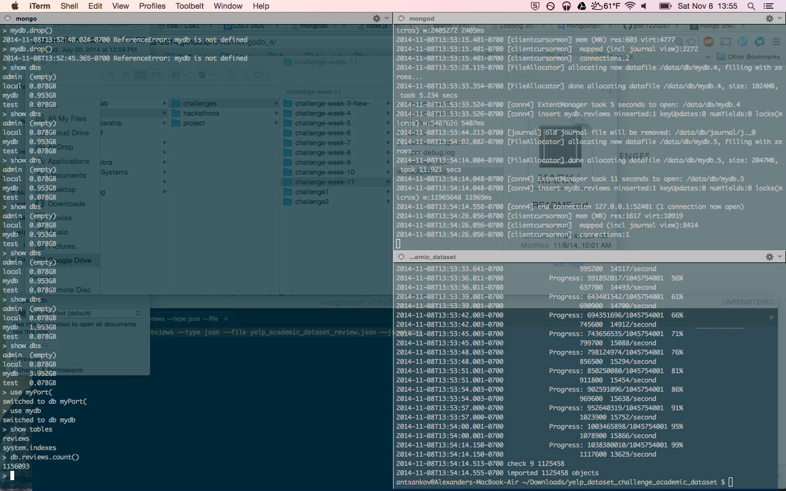
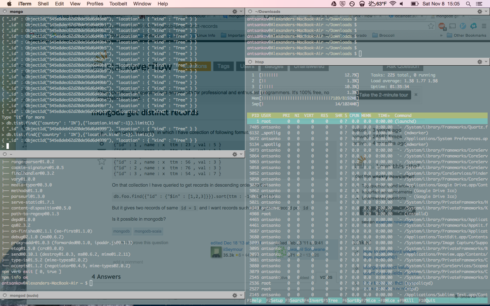

# Name

Alexander Tsankov

# How many points have you earned?

93/100

(Make your own calculation and replace the number 0 with the points you think you've earned.)

# How many hours have you spent on this?

6

# When did you first start working on this week's learning challenges?

11/6/14

# What is the most difficult part about this week's challenge?

Million entry bird problem. 

# Graph Database I

## Checkpoints (5 points x 3 = 15 points)

### 1. (5 point)

### 2. (5 point)

### 3. (5 point)

# MongoDB IV

## Challenges (5 points x 4 = 20 points)

### 1. (5 point)

Count

FindOne

Query

### 2. (5 point)

Count

FindOne

Query

### 3. (5 point)

Count

FindOne

Query

### 4. (5 point)

Count

FindOne

Query 1

Query 2

# Machine Learning III

## Checkpoints (5 points x 2 = 10 points)

### 1. (5 point)

### 2. (5 point)

## Challenges (5 points x 4 = 20 points)

### 1. (5 point)

Accuracy = 64.1273

Features/Parameters

	%%%%%%%%%% Choose feature source %%%%%%%%%%%
	add_accelerometer = false; % Adds accelerometer features
	add_gyroscope = false; % Adds gyroscope features
	add_magneticField = true; % Adds magnetic field features
	add_gravity = false; % Adds gravity features
	add_linearAcceleration = false; % Adds linear acceleration features
	add_orientation = false; % Adds azimuth, pich and roll features
	add_light = true; % Adds light value
	add_proximity = false; % Adds proximity value
	add_studentID = false; % Adds student ID
	%%%%%%%%%%%%%%%%%%%%%%%%%%%%%%%%%%%%%%%%%%%%

	%%%%%%%%% Choose machine learning classifier parameters %%%%%%%%%%%%%%%
	numTrees = 1; % Try different number of trees for the Random Forest classifier
	sigma = 1; % Try different values of sigma for the Support Vector Machine classifier
	dist = 'normal'; % Try different distributions = {'normal', 'kernel', 'mvmn' , 'mn'} for Naive Bayes classifier
	K = 20; % Try different values of K for the K-nearest Neighbor classifier
	%%%%%%%%%%%%%%%%%%%%%%%%%%%%%%%%%%%%%%%%%%%%%%%%%%%%%%%%%%%%%%%%%%%%%%%%

### 2. (5 point)

Accuracy = 64.1273

Features/Parameters

	%%%%%%%%% Choose feature source %%%%%%%%%%%
add_accelerometer = false; % Adds accelerometer features
add_gyroscope = false; % Adds gyroscope features
add_magneticField = true; % Adds magnetic field features
add_gravity = false; % Adds gravity features
add_linearAcceleration = false; % Adds linear acceleration features
add_orientation = false; % Adds azimuth, pich and roll features
add_light = true; % Adds light value
add_proximity = false; % Adds proximity value
add_studentID = false; % Adds student ID
%%%%%%%%%%%%%%%%%%%%%%%%%%%%%%%%%%%%%%%%%%%%

%%%%%%%%% Choose machine learning classifier parameters %%%%%%%%%%%%%%%
numTrees = 1; % Try different number of trees for the Random Forest classifier
sigma = 1; % Try different values of sigma for the Support Vector Machine classifier
dist = 'kernel'; % Try different distributions = {'normal', 'kernel', 'mvmn' , 'mn'} for Naive Bayes classifier
K = 20; % Try different values of K for the K-nearest Neighbor classifier
%%%%%%%%%%%%%%%%%%%%%%%%%%%%%%%%%%%%%%%%%%%%%%%%%%%%%%%%%%%%%%%%%%%%%%%%

### 3. (5 point)

Accuracy = 60.2700

Features/Parameters

%%%%%%%%% Choose feature source %%%%%%%%%%%
add_accelerometer = false; % Adds accelerometer features
add_gyroscope = false; % Adds gyroscope features
add_magneticField = true; % Adds magnetic field features
add_gravity = false; % Adds gravity features
add_linearAcceleration = false; % Adds linear acceleration features
add_orientation = false; % Adds azimuth, pich and roll features
add_light = true; % Adds light value
add_proximity = false; % Adds proximity value
add_studentID = false; % Adds student ID
%%%%%%%%%%%%%%%%%%%%%%%%%%%%%%%%%%%%%%%%%%%%

%%%%%%%%% Choose machine learning classifier parameters %%%%%%%%%%%%%%%
numTrees = 10; % Try different number of trees for the Random Forest classifier
sigma = 1; % Try different values of sigma for the Support Vector Machine classifier
dist = 'kernel'; % Try different distributions = {'normal', 'kernel', 'mvmn' , 'mn'} for Naive Bayes classifier
K = 20; % Try different values of K for the K-nearest Neighbor classifier
%%%%%%%%%%%%%%%%%%%%%%%%%%%%%%%%%%%%%%%%%%%%%%%%%%%%%%%%%%%%%%%%%%%%%%%%

### 4. (5 point)

Accuracy = 57.5699

Features/Parameters

%%%%%%%%% Choose feature source %%%%%%%%%%%
add_accelerometer = false; % Adds accelerometer features
add_gyroscope = false; % Adds gyroscope features
add_magneticField = true; % Adds magnetic field features
add_gravity = false; % Adds gravity features
add_linearAcceleration = false; % Adds linear acceleration features
add_orientation = false; % Adds azimuth, pich and roll features
add_light = true; % Adds light value
add_proximity = false; % Adds proximity value
add_studentID = false; % Adds student ID
%%%%%%%%%%%%%%%%%%%%%%%%%%%%%%%%%%%%%%%%%%%%

%%%%%%%%% Choose machine learning classifier parameters %%%%%%%%%%%%%%%
numTrees = 10; % Try different number of trees for the Random Forest classifier
sigma = 1; % Try different values of sigma for the Support Vector Machine classifier
dist = 'kernel'; % Try different distributions = {'normal', 'kernel', 'mvmn' , 'mn'} for Naive Bayes classifier
K = 20; % Try different values of K for the K-nearest Neighbor classifier
%%%%%%%%%%%%%%%%%%%%%%%%%%%%%%%%%%%%%%%%%%%%%%%%%%%%%%%%%%%%%%%%%%%%%%%%

# D3 (VI) (5 points x 7 = 35 points)

### 1. (5 point)

### 2. (5 point)

### 3. (5 point)

### 4. (5 point)

### 5. (5 point)

### 6. (5 point)

### 7. (5 point)

