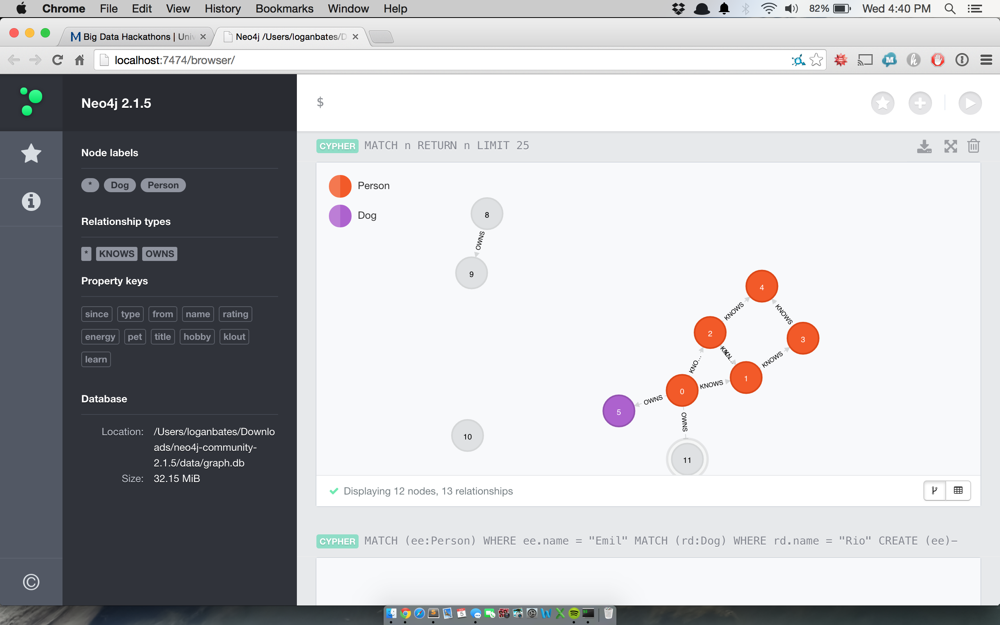
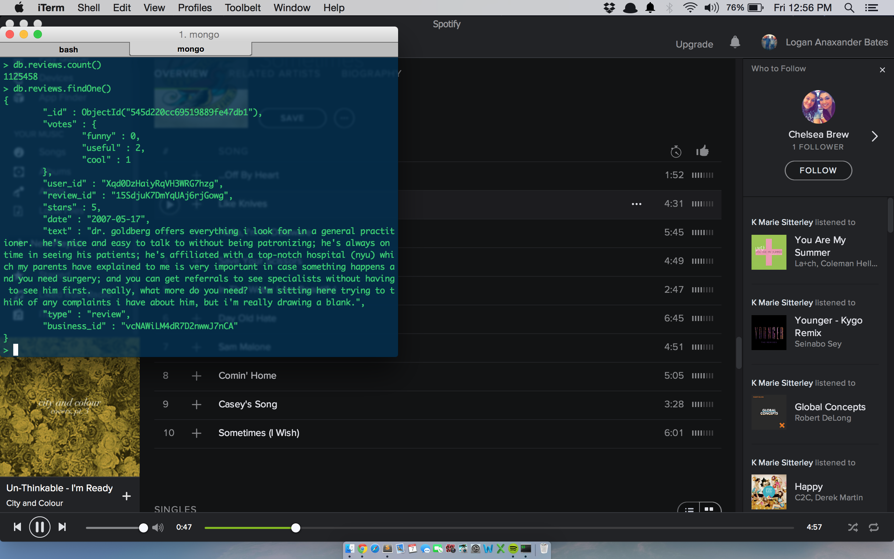

# Name

Logan Bates

# How many points have you earned?

95/100

(Make your own calculation and replace the number 0 with the points you think you've earned.)

# How many hours have you spent on this?

4

# When did you first start working on this week's learning challenges?

Tuesday

# What is the most difficult part about this week's challenge?

Challenge 4 mongo

# Graph Database I

## Checkpoints (5 points x 3 = 15 points)

### 1. (5 point)

### 2. (5 point)

### 3. (5 point)

# MongoDB IV

## Challenges (5 points x 4 = 20 points)

### 1. (5 point)

Count

FindOne

Query (db.reviews.find({'stars':5}, {'text':1}))
Find all text for 5 star reviews

### 2. (5 point)

Count

FindOne

Query

### 3. (5 point)

Count

FindOne

Query

### 4. (5 point)

Count

FindOne

Query 1

Query 2

# Machine Learning III

## Checkpoints (5 points x 2 = 10 points)

### 1. (5 point)

### 2. (5 point)

## Challenges (5 points x 4 = 20 points)

### 1. (5 point)

Accuracy = 74.7348

Features/Parameters

	%%%%%%%%% Choose feature source %%%%%%%%%%%
	add_accelerometer = false; % Adds accelerometer features
	add_gyroscope = false; % Adds gyroscope features
	add_magneticField = true; % Adds magnetic field features
	add_gravity = false; % Adds gravity features
	add_linearAcceleration = false; % Adds linear acceleration features
	add_orientation = true; % Adds azimuth, pich and roll features
	add_light = false; % Adds light value
	add_proximity = false; % Adds proximity value
	add_studentID = false; % Adds student ID
	%%%%%%%%%%%%%%%%%%%%%%%%%%%%%%%%%%%%%%%%%%%%

	%%%%%%%%% Choose machine learning classifier parameters %%%%%%%%%%%%%%%
	numTrees = 1; % Try different number of trees for the Random Forest classifier
	sigma = 1; % Try different values of sigma for the Support Vector Machine class$
	dist = 'normal'; % Try different distributions = {'normal', 'kernel', 'mvmn' , $
	K = 10; % Try different values of K for the K-nearest Neighbor classifier
	%%%%%%%%%%%%%%%%%%%%%%%%%%%%%%%%%%%%%%%%%%%%%%%%%%%%%%%%%%%%%%%%%%%%%%%%

### 2. (5 point)

Accuracy = 67.1167

Features/Parameters

	%%%%%%%%% Choose feature source %%%%%%%%%%%
	add_accelerometer = false; % Adds accelerometer features
	add_gyroscope = false; % Adds gyroscope features
	add_magneticField = true; % Adds magnetic field features
	add_gravity = false; % Adds gravity features
	add_linearAcceleration = false; % Adds linear acceleration features
	add_orientation = true; % Adds azimuth, pich and roll features
	add_light = false; % Adds light value
	add_proximity = false; % Adds proximity value
	add_studentID = false; % Adds student ID
	%%%%%%%%%%%%%%%%%%%%%%%%%%%%%%%%%%%%%%%%%%%%

	%%%%%%%%% Choose machine learning classifier parameters %%%%%%%%%%%%%%%
	numTrees = 1; % Try different number of trees for the Random Forest classifier
	sigma = 1; % Try different values of sigma for the Support Vector Machine class$
	dist = 'normal'; % Try different distributions = {'normal', 'kernel', 'mvmn' , $
	K = 10; % Try different values of K for the K-nearest Neighbor classifier
	%%%%%%%%%%%%%%%%%%%%%%%%%%%%%%%%%%%%%%%%%%%%%%%%%%%%%%%%%%%%%%%%%%%%%%%%

### 3. (5 point)

Accuracy = 71.3597

Features/Parameters

	%%%%%%%%% Choose feature source %%%%%%%%%%%
	add_accelerometer = false; % Adds accelerometer features
	add_gyroscope = false; % Adds gyroscope features
	add_magneticField = true; % Adds magnetic field features
	add_gravity = false; % Adds gravity features
	add_linearAcceleration = false; % Adds linear acceleration features
	add_orientation = true; % Adds azimuth, pich and roll features
	add_light = false; % Adds light value
	add_proximity = false; % Adds proximity value
	add_studentID = false; % Adds student ID
	%%%%%%%%%%%%%%%%%%%%%%%%%%%%%%%%%%%%%%%%%%%%

	%%%%%%%%% Choose machine learning classifier parameters %%%%%%%%%%%%%%%
	numTrees = 1; % Try different number of trees for the Random Forest classifier
	sigma = 1; % Try different values of sigma for the Support Vector Machine class$
	dist = 'normal'; % Try different distributions = {'normal', 'kernel', 'mvmn' , $
	K = 10; % Try different values of K for the K-nearest Neighbor classifier
	%%%%%%%%%%%%%%%%%%%%%%%%%%%%%%%%%%%%%%%%%%%%%%%%%%%%%%%%%%%%%%%%%%%%%%%%

### 4. (5 point)

Accuracy = 75.8920

Features/Parameters

	%%%%%%%%% Choose feature source %%%%%%%%%%%
	add_accelerometer = false; % Adds accelerometer features
	add_gyroscope = false; % Adds gyroscope features
	add_magneticField = true; % Adds magnetic field features
	add_gravity = false; % Adds gravity features
	add_linearAcceleration = false; % Adds linear acceleration features
	add_orientation = true; % Adds azimuth, pich and roll features
	add_light = false; % Adds light value
	add_proximity = false; % Adds proximity value
	add_studentID = false; % Adds student ID
	%%%%%%%%%%%%%%%%%%%%%%%%%%%%%%%%%%%%%%%%%%%%

	%%%%%%%%% Choose machine learning classifier parameters %%%%%%%%%%%%%%%
	numTrees = 10; % Try different number of trees for the Random Forest classifier
	sigma = 1; % Try different values of sigma for the Support Vector Machine class$
	dist = 'normal'; % Try different distributions = {'normal', 'kernel', 'mvmn' , $
	K = 10; % Try different values of K for the K-nearest Neighbor classifier
	%%%%%%%%%%%%%%%%%%%%%%%%%%%%%%%%%%%%%%%%%%%%%%%%%%%%%%%%%%%%%%%%%%%%%%%%

# D3 (VI) (5 points x 7 = 35 points)

### 1. (5 point)

### 2. (5 point)

### 3. (5 point)

### 4. (5 point)

### 5. (5 point)

### 6. (5 point)

### 7. (5 point)

