# Name

Chris Wittenberg

# How many points have you earned?

39/100

(Make your own calculation and replace the number 0 with the points you think you've earned.)

# How many hours have you spent on this?

fill-in-your-answer

# When did you first start working on this week's learning challenges?

Wednesday

# What is the most difficult part about this week's challenge?

Getting Neo4j to find the right version of java. Also converting the csv file to json.

# Graph Database I

## Checkpoints (5 points x 3 = 15 points)

### 1. (5 point)

### 2. (5 point)

### 3. (5 point)

# MongoDB IV

## Challenges (5 points x 4 = 20 points)

### 1. (5 point)

Count

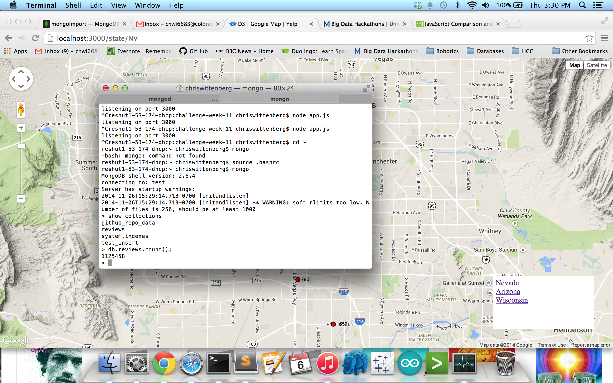

FindOne

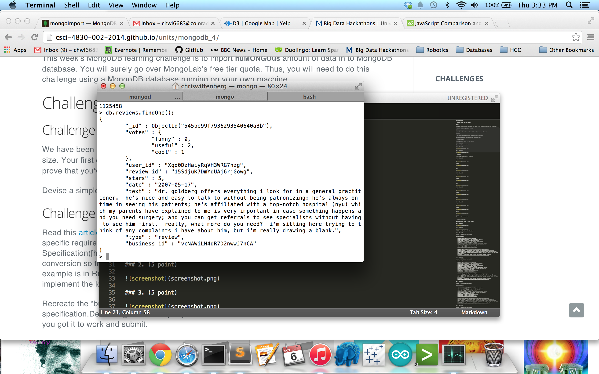

Query

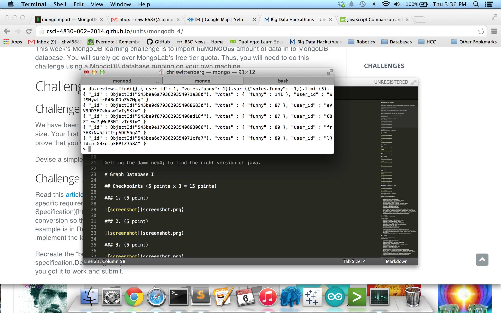

### 2. (5 point)

CCount

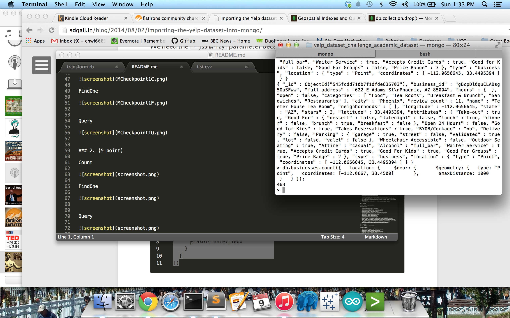

FindOne

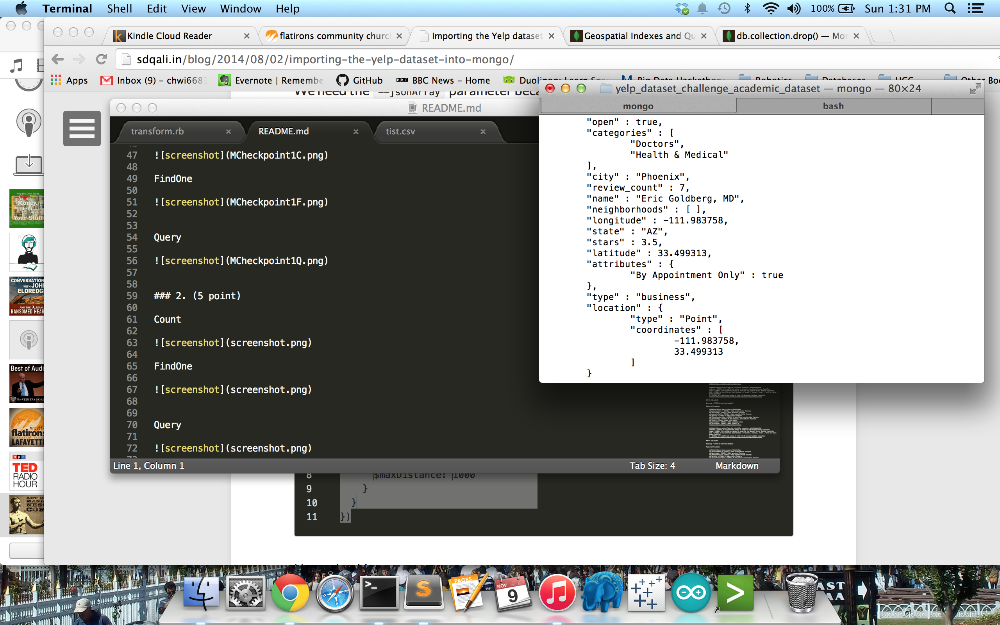

Query

### 3. (5 point)

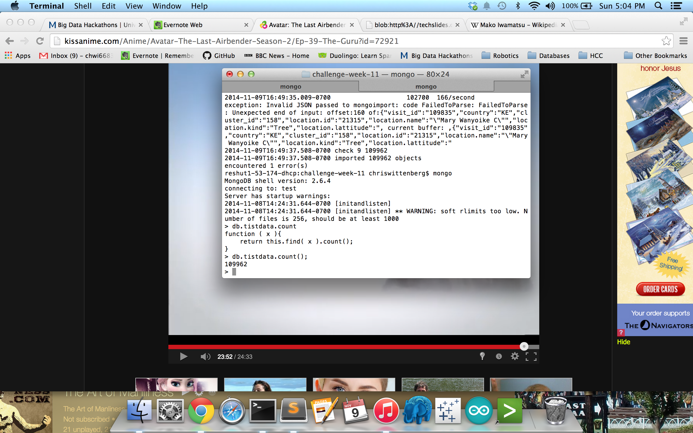

FindOne

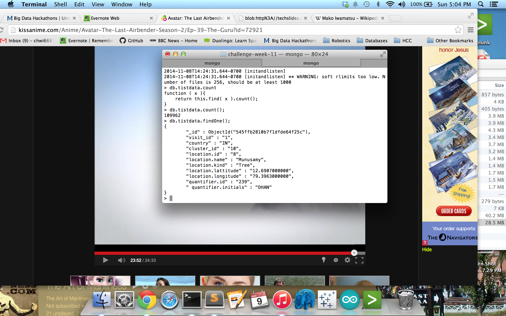

Query

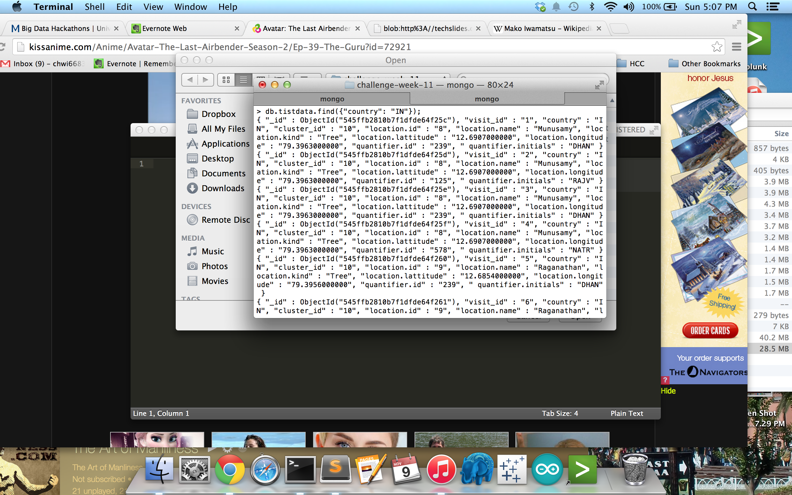

### 4. (5 point)

Count

FindOne

Query 1

Query 2

# Machine Learning III

## Checkpoints (5 points x 2 = 10 points)

### 1. (5 point)

### 2. (5 point)

## Challenges (5 points x 4 = 20 points)

### 1. (5 point)

Accuracy = {fill-in-your-best-number}

Features/Parameters

	%%%%%%%%% Choose feature source %%%%%%%%%%%
	add_accelerometer = {TODO}; % Adds accelerometer features
	add_gyroscope = {TODO}; % Adds gyroscope features
	add_magneticField = {TODO}; % Adds magnetic field features
	add_gravity = {TODO}; % Adds gravity features
	add_linearAcceleration = {TODO}; % Adds linear acceleration features
	add_orientation = {TODO}; % Adds azimuth, pich and roll features
	add_light = {TODO}; % Adds light value
	add_proximity = {TODO}; % Adds proximity value
	add_studentID = {TODO}; % Adds student ID
	%%%%%%%%%%%%%%%%%%%%%%%%%%%%%%%%%%%%%%%%%%%%
	 
	%%%%%%%%% Choose machine learning classifier parameters %%%%%%%%%%%%%%%
	numTrees = {TODO}; % Try different number of trees for the Random Forest classifier
	sigma = {TODO}; % Try different values of sigma for the Support Vector Machine classifier
	dist = {TODO}; % Try different distributions = {'normal', 'kernel', 'mvmn' , 'mn'} for Naive Bayes classifier
	K = {TODO}; % Try different values of K for the K-nearest Neighbor classifier
	%%%%%%%%%%%%%%%%%%%%%%%%%%%%%%%%%%%%%%%%%%%%%%%%%%%%%%%%%%%%%%%%%%%%%%%%

### 2. (5 point)

Accuracy = {fill-in-your-best-number}

Features/Parameters

	%%%%%%%%% Choose feature source %%%%%%%%%%%
	add_accelerometer = {TODO}; % Adds accelerometer features
	add_gyroscope = {TODO}; % Adds gyroscope features
	add_magneticField = {TODO}; % Adds magnetic field features
	add_gravity = {TODO}; % Adds gravity features
	add_linearAcceleration = {TODO}; % Adds linear acceleration features
	add_orientation = {TODO}; % Adds azimuth, pich and roll features
	add_light = {TODO}; % Adds light value
	add_proximity = {TODO}; % Adds proximity value
	add_studentID = {TODO}; % Adds student ID
	%%%%%%%%%%%%%%%%%%%%%%%%%%%%%%%%%%%%%%%%%%%%
	 
	%%%%%%%%% Choose machine learning classifier parameters %%%%%%%%%%%%%%%
	numTrees = {TODO}; % Try different number of trees for the Random Forest classifier
	sigma = {TODO}; % Try different values of sigma for the Support Vector Machine classifier
	dist = {TODO}; % Try different distributions = {'normal', 'kernel', 'mvmn' , 'mn'} for Naive Bayes classifier
	K = {TODO}; % Try different values of K for the K-nearest Neighbor classifier
	%%%%%%%%%%%%%%%%%%%%%%%%%%%%%%%%%%%%%%%%%%%%%%%%%%%%%%%%%%%%%%%%%%%%%%%%

### 3. (5 point)

Accuracy = {fill-in-your-best-number}

Features/Parameters

	%%%%%%%%% Choose feature source %%%%%%%%%%%
	add_accelerometer = {TODO}; % Adds accelerometer features
	add_gyroscope = {TODO}; % Adds gyroscope features
	add_magneticField = {TODO}; % Adds magnetic field features
	add_gravity = {TODO}; % Adds gravity features
	add_linearAcceleration = {TODO}; % Adds linear acceleration features
	add_orientation = {TODO}; % Adds azimuth, pich and roll features
	add_light = {TODO}; % Adds light value
	add_proximity = {TODO}; % Adds proximity value
	add_studentID = {TODO}; % Adds student ID
	%%%%%%%%%%%%%%%%%%%%%%%%%%%%%%%%%%%%%%%%%%%%
	 
	%%%%%%%%% Choose machine learning classifier parameters %%%%%%%%%%%%%%%
	numTrees = {TODO}; % Try different number of trees for the Random Forest classifier
	sigma = {TODO}; % Try different values of sigma for the Support Vector Machine classifier
	dist = {TODO}; % Try different distributions = {'normal', 'kernel', 'mvmn' , 'mn'} for Naive Bayes classifier
	K = {TODO}; % Try different values of K for the K-nearest Neighbor classifier
	%%%%%%%%%%%%%%%%%%%%%%%%%%%%%%%%%%%%%%%%%%%%%%%%%%%%%%%%%%%%%%%%%%%%%%%%

### 4. (5 point)

Accuracy = {fill-in-your-best-number}

Features/Parameters

	%%%%%%%%% Choose feature source %%%%%%%%%%%
	add_accelerometer = {TODO}; % Adds accelerometer features
	add_gyroscope = {TODO}; % Adds gyroscope features
	add_magneticField = {TODO}; % Adds magnetic field features
	add_gravity = {TODO}; % Adds gravity features
	add_linearAcceleration = {TODO}; % Adds linear acceleration features
	add_orientation = {TODO}; % Adds azimuth, pich and roll features
	add_light = {TODO}; % Adds light value
	add_proximity = {TODO}; % Adds proximity value
	add_studentID = {TODO}; % Adds student ID
	%%%%%%%%%%%%%%%%%%%%%%%%%%%%%%%%%%%%%%%%%%%%
	 
	%%%%%%%%% Choose machine learning classifier parameters %%%%%%%%%%%%%%%
	numTrees = {TODO}; % Try different number of trees for the Random Forest classifier
	sigma = {TODO}; % Try different values of sigma for the Support Vector Machine classifier
	dist = {TODO}; % Try different distributions = {'normal', 'kernel', 'mvmn' , 'mn'} for Naive Bayes classifier
	K = {TODO}; % Try different values of K for the K-nearest Neighbor classifier
	%%%%%%%%%%%%%%%%%%%%%%%%%%%%%%%%%%%%%%%%%%%%%%%%%%%%%%%%%%%%%%%%%%%%%%%%

# D3 (VI) (5 points x 7 = 35 points)

### 1. (5 point)

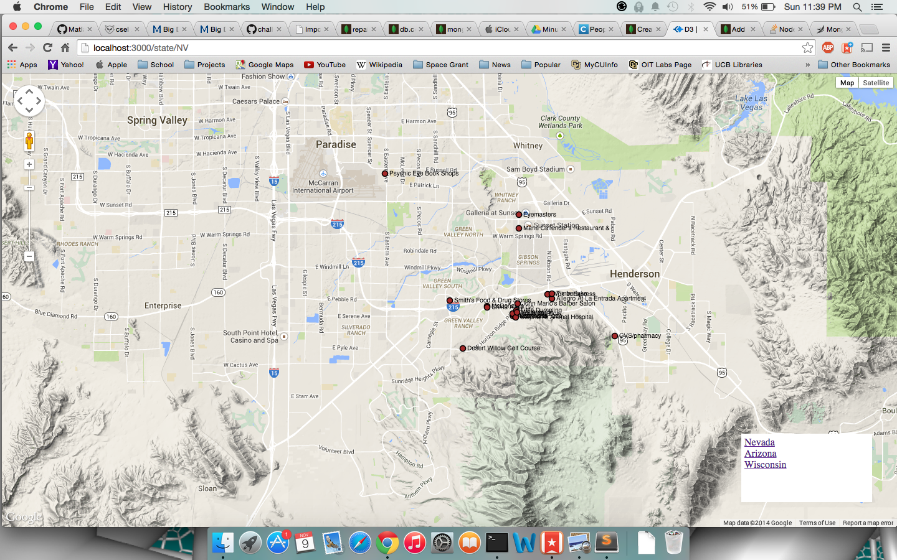

### 2. (5 point)

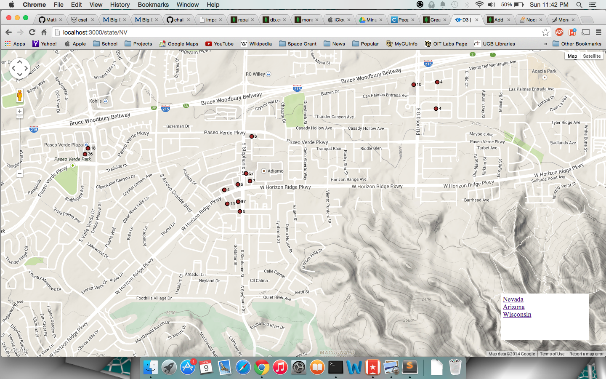

### 3. (5 point)

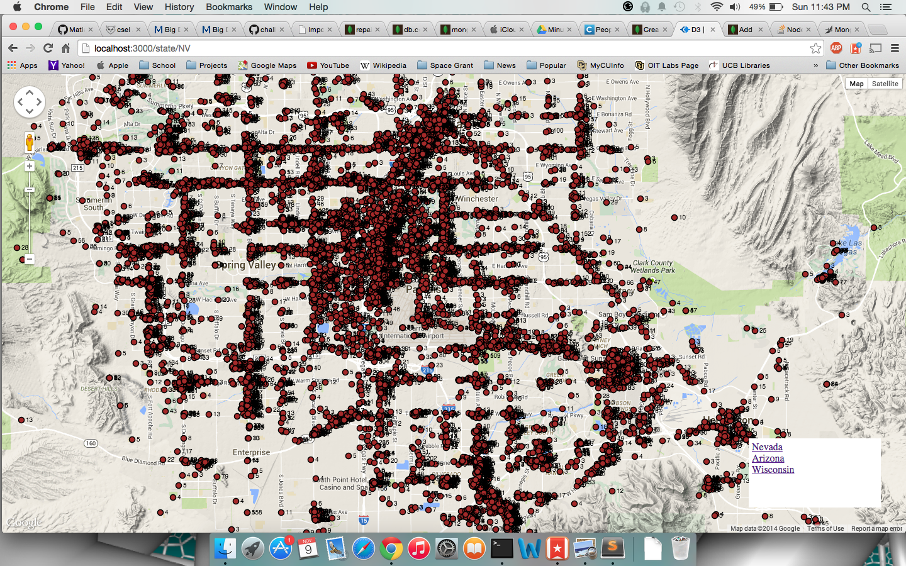

### 4. (5 point)

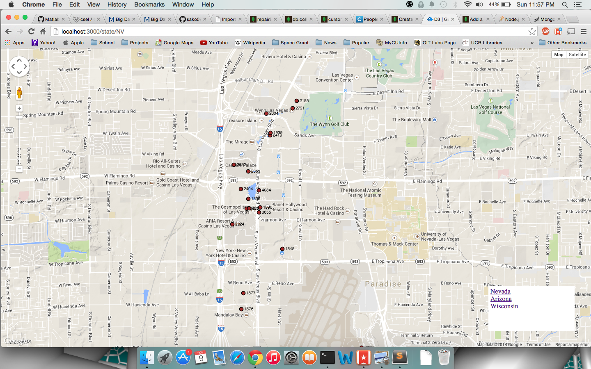

### 5. (5 point)

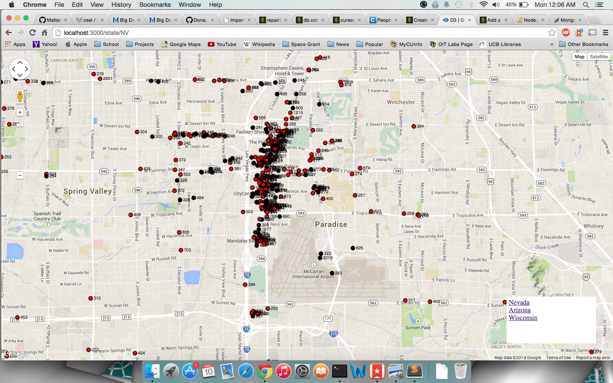

### 6. (5 point)

### 7. (5 point)

