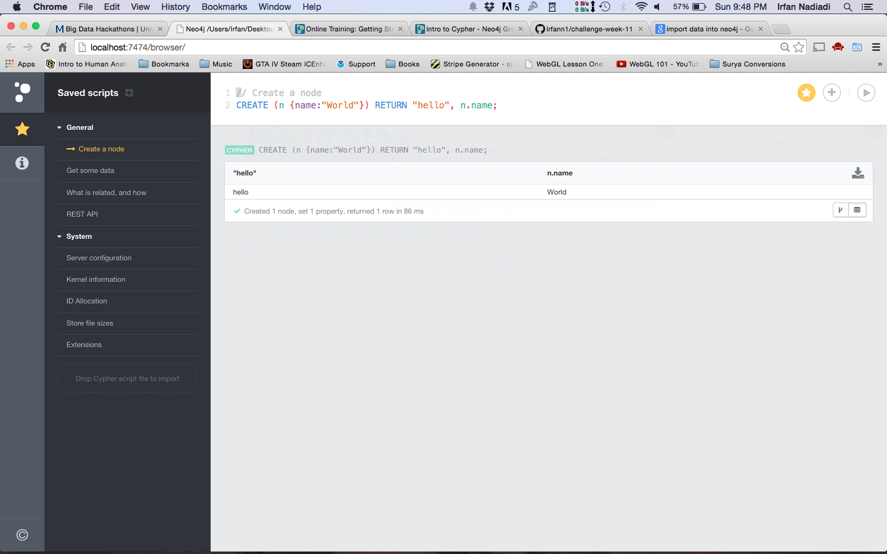
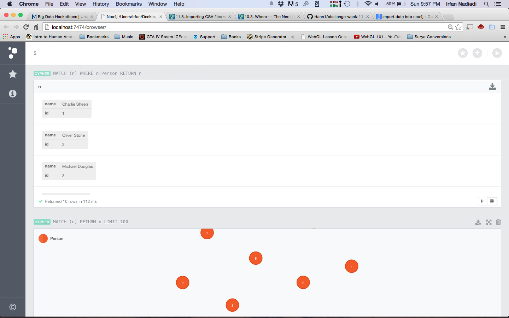
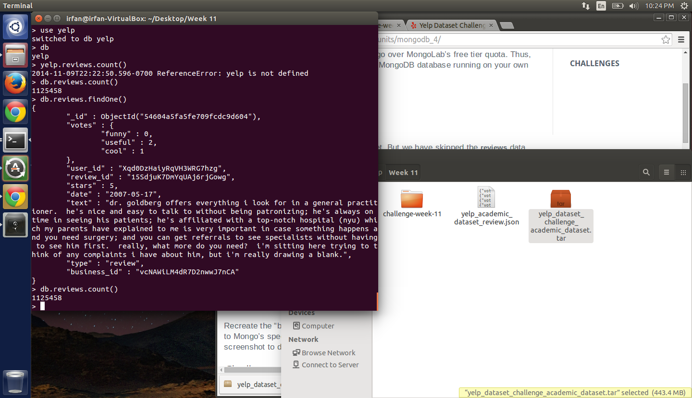
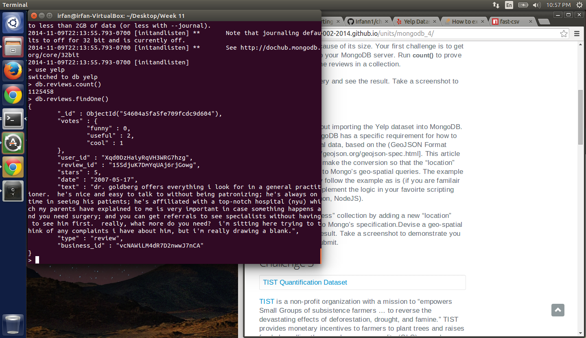
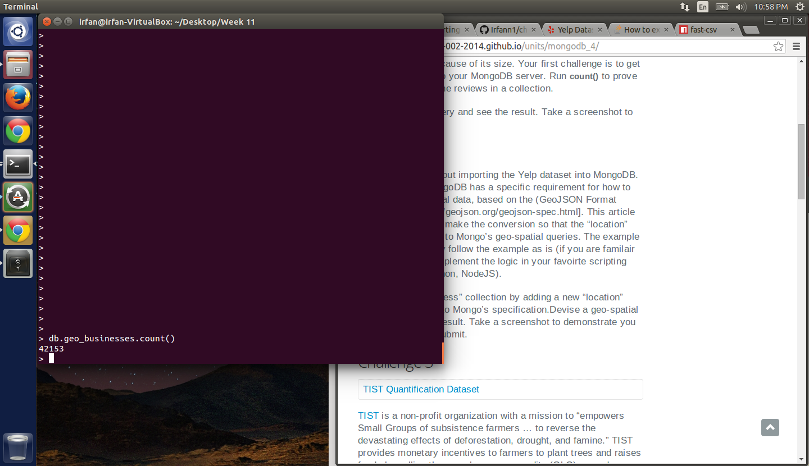
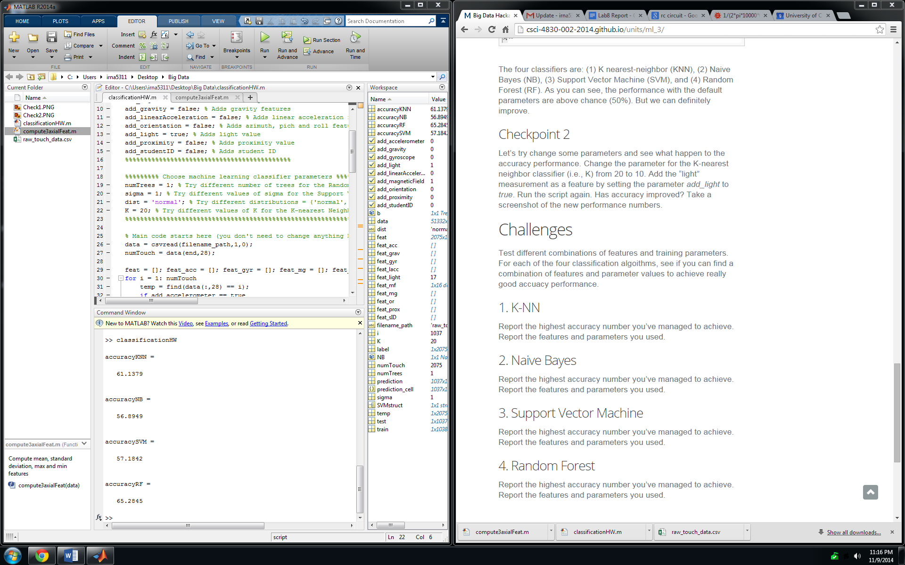
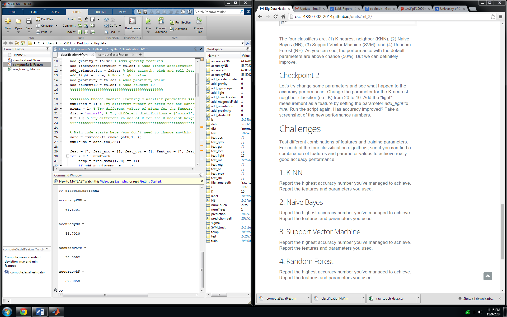

# Name

Irfan Nadiadi

# How many points have you earned?

0/100

(Make your own calculation and replace the number 0 with the points you think you've earned.)

# How many hours have you spent on this?

fill-in-your-answer

# When did you first start working on this week's learning challenges?

fill-in-your-answer

# What is the most difficult part about this week's challenge?

fill-in-your-answer

# Graph Database I

## Checkpoints (5 points x 3 = 15 points)

### 1. (5 point)

### 2. (5 point)

### 3. (5 point)

# MongoDB IV

## Challenges (5 points x 4 = 20 points)

### 1. (5 point)

Count

FindOne
 

Query

### 2. (5 point)

Count

FindOne

Query

### 3. (5 point)

Count

FindOne

Query

### 4. (5 point)

Count

FindOne

Query 1

Query 2

# Machine Learning III

## Checkpoints (5 points x 2 = 10 points)

### 1. (5 point)

### 2. (5 point)

## Challenges (5 points x 4 = 20 points)

### 1. (5 point)

Accuracy = 84.5709

Features/Parameters

	%%%%%%%%% Choose feature source %%%%%%%%%%%
	add_accelerometer = true; % Adds accelerometer features
	add_gyroscope = true; % Adds gyroscope features
	add_magneticField = true; % Adds magnetic field features
	add_gravity = false; % Adds gravity features
	add_linearAcceleration = true; % Adds linear acceleration features
	add_orientation = false; % Adds azimuth, pich and roll features
	add_light = false; % Adds light value
	add_proximity = false; % Adds proximity value
	add_studentID = false; % Adds student ID
	%%%%%%%%%%%%%%%%%%%%%%%%%%%%%%%%%%%%%%%%%%%%
	 
	%%%%%%%%% Choose machine learning classifier parameters %%%%%%%%%%%%%%%
	numTrees = 3; % Try different number of trees for the Random Forest classifier
	sigma = 3; % Try different values of sigma for the Support Vector Machine classifier
	dist = 'kernel'; % Try different distributions = {'normal', 'kernel', 'mvmn' , 'mn'} for Naive Bayes classifier
	K = 8; % Try different values of K for the K-nearest Neighbor classifier
	%%%%%%%%%%%%%%%%%%%%%%%%%%%%%%%%%%%%%%%%%%%%%%%%%%%%%%%%%%%%%%%%%%%%%%%%

### 2. (5 point)

Accuracy = 75.8920

Features/Parameters

	%%%%%%%%% Choose feature source %%%%%%%%%%%
	add_accelerometer = true; % Adds accelerometer features
	add_gyroscope = true; % Adds gyroscope features
	add_magneticField = true; % Adds magnetic field features
	add_gravity = false; % Adds gravity features
	add_linearAcceleration = true; % Adds linear acceleration features
	add_orientation = false; % Adds azimuth, pich and roll features
	add_light = false; % Adds light value
	add_proximity = false; % Adds proximity value
	add_studentID = false; % Adds student ID
	%%%%%%%%%%%%%%%%%%%%%%%%%%%%%%%%%%%%%%%%%%%%
	 
	%%%%%%%%% Choose machine learning classifier parameters %%%%%%%%%%%%%%%
	numTrees = 3; % Try different number of trees for the Random Forest classifier
	sigma = 1; % Try different values of sigma for the Support Vector Machine classifier
	dist = 'kernel'; % Try different distributions = {'normal', 'kernel', 'mvmn' , 'mn'} for Naive Bayes classifier
	K = 20; % Try different values of K for the K-nearest Neighbor classifier
	%%%%%%%%%%%%%%%%%%%%%%%%%%%%%%%%%%%%%%%%%%%%%%%%%%%%%%%%%%%%%%%%%%%%%%%%

### 3. (5 point)

Accuracy = 95.4677

Features/Parameters

	%%%%%%%%% Choose feature source %%%%%%%%%%%
	add_accelerometer = true; % Adds accelerometer features
	add_gyroscope = true; % Adds gyroscope features
	add_magneticField = true; % Adds magnetic field features
	add_gravity = false; % Adds gravity features
	add_linearAcceleration = true; % Adds linear acceleration features
	add_orientation = false; % Adds azimuth, pich and roll features
	add_light = false; % Adds light value
	add_proximity = false; % Adds proximity value
	add_studentID = false; % Adds student ID
	%%%%%%%%%%%%%%%%%%%%%%%%%%%%%%%%%%%%%%%%%%%%
	 
	%%%%%%%%% Choose machine learning classifier parameters %%%%%%%%%%%%%%%
	numTrees = 3; % Try different number of trees for the Random Forest classifier
	sigma = 3; % Try different values of sigma for the Support Vector Machine classifier
	dist = 'kernel'; % Try different distributions = {'normal', 'kernel', 'mvmn' , 'mn'} for Naive Bayes classifier
	K = 10; % Try different values of K for the K-nearest Neighbor classifier
	%%%%%%%%%%%%%%%%%%%%%%%%%%%%%%%%%%%%%%%%%%%%%%%%%%%%%%%%%%%%%%%%%%%%%%%%

### 4. (5 point)

Accuracy = 85.9209

Features/Parameters

	%%%%%%%%% Choose feature source %%%%%%%%%%%
	add_accelerometer = true; % Adds accelerometer features
	add_gyroscope = true; % Adds gyroscope features
	add_magneticField = true; % Adds magnetic field features
	add_gravity = false; % Adds gravity features
	add_linearAcceleration = true; % Adds linear acceleration features
	add_orientation = false; % Adds azimuth, pich and roll features
	add_light = false; % Adds light value
	add_proximity = false; % Adds proximity value
	add_studentID = false; % Adds student ID
	%%%%%%%%%%%%%%%%%%%%%%%%%%%%%%%%%%%%%%%%%%%%
	 
	%%%%%%%%% Choose machine learning classifier parameters %%%%%%%%%%%%%%%
	numTrees = 3; % Try different number of trees for the Random Forest classifier
	sigma = 3; % Try different values of sigma for the Support Vector Machine classifier
	dist = 'normal'; % Try different distributions = {'normal', 'kernel', 'mvmn' , 'mn'} for Naive Bayes classifier
	K = 09; % Try different values of K for the K-nearest Neighbor classifier
	%%%%%%%%%%%%%%%%%%%%%%%%%%%%%%%%%%%%%%%%%%%%%%%%%%%%%%%%%%%%%%%%%%%%%%%%

# D3 (VI) (5 points x 7 = 35 points)

### 1. (5 point)

### 2. (5 point)

### 3. (5 point)

### 4. (5 point)

### 5. (5 point)

### 6. (5 point)

### 7. (5 point)

